# Base de Datos — Filosofar

Motor: SQLite vía Room 2.6.1. Esquema versión 1. Ver DDL completo en `database/schema.sql` y datos de muestra en `database/sample_data.sql`.

## Diagrama entidad-relación (Mermaid)

```mermaid
erDiagram
    user_profile {
        int id PK
        text alias
        int avatarId
        int onboardingCompleted
    }

    philosophy_island {
        text id PK
        text name
        int sortOrder
        int unlockRequiredCrystals
    }

    daily_question {
        text id PK
        text islandId FK
        text text
        int orderInIsland
    }
    question_attempt {
        int id PK
        text questionId FK
        text answerText
        int wordCount
    }

    dilemma {
        text id PK
        text islandId FK
        text title
        text scenario
    }
    dilemma_option {
        text id PK
        text dilemmaId FK
        text label
        text lumiView
        text noxView
    }
    dilemma_attempt {
        int id PK
        text dilemmaId FK
        text chosenOptionId FK
        int viewedAlternativePerspective
    }

    reason_card {
        text id PK
        text text
        text valueTags
    }

    perspective_exercise {
        text id PK
        text islandId FK
        text situation
    }
    perspective_attempt {
        int id PK
        text exerciseId FK
        text choseRole
        int revealedOtherRole
    }

    logic_challenge {
        text id PK
        text islandId FK
        text type
        text prompt
    }
    logic_challenge_item {
        text id PK
        text challengeId FK
        text text
        int correctPosition
        text pairKey
        text role
        int isFlawed
    }
    logic_attempt {
        int id PK
        text challengeId FK
        int wasCorrect
        int attemptsUsed
    }

    self_debate {
        text id PK
        text islandId FK
        text topic
    }
    debate_argument {
        text id PK
        text debateId FK
        text correctSide
        text text
    }
    self_debate_attempt {
        int id PK
        text debateId FK
        int correctlyPlacedCount
        text personalConclusion
    }

    opinion_revision {
        int id PK
        text questionId FK
        text previousAnswerSnapshot
        text newAnswerText
        int opinionChanged
    }

    reflection {
        int id PK
        text title
        text bodyText
    }
    voice_reflection_metadata {
        int id PK
        int reflectionId FK
        text filePath
        int durationMs
    }

    island_progress {
        text islandId PK "FK -> philosophy_island"
        int crystalsEarned
        int crystalsTotal
        text status
    }

    badge {
        text id PK
        text name
        text unlockCriteriaKey
    }
    user_badge {
        text badgeId PK "FK -> badge"
        int unlockedAtEpochMs
    }

    philosophy_island ||--o{ daily_question : contiene
    daily_question ||--o{ question_attempt : tiene
    philosophy_island ||--o{ dilemma : contiene
    dilemma ||--o{ dilemma_option : tiene
    dilemma ||--o{ dilemma_attempt : tiene
    dilemma_option ||--o{ dilemma_attempt : elegida_en
    philosophy_island ||--o{ perspective_exercise : contiene
    perspective_exercise ||--o{ perspective_attempt : tiene
    philosophy_island ||--o{ logic_challenge : contiene
    logic_challenge ||--o{ logic_challenge_item : tiene
    logic_challenge ||--o{ logic_attempt : tiene
    philosophy_island ||--o{ self_debate : contiene
    self_debate ||--o{ debate_argument : tiene
    self_debate ||--o{ self_debate_attempt : tiene
    daily_question ||--o{ opinion_revision : revisada_en
    reflection ||--o| voice_reflection_metadata : tiene
    philosophy_island ||--|| island_progress : progreso_de
    badge ||--o| user_badge : desbloqueada_en
```



## Detalle de tablas

### user_profile
Fila única (`id` fijo = 1). `alias` (texto libre, nunca nombre real), `avatarId` (0-7), flags `onboardingCompleted`/`soundEnabled`/`hapticsEnabled`, timestamps de creación y último uso.

### philosophy_island
6 filas fijas. `sortOrder` determina el orden de desbloqueo sugerido; `unlockRequiredCrystals` es el umbral de cristales **globales** (suma de todas las islas) necesario para que dicha isla pase de LOCKED a AVAILABLE.

### daily_question / question_attempt
Banco de preguntas por isla (`orderInIsland` para orden estable) y su historial de respuestas. Una pregunta puede tener múltiples intentos a lo largo del tiempo (usado por el módulo Antes/Ahora).

### dilemma / dilemma_option / dilemma_attempt
Un dilema tiene 3-4 opciones, cada una con `consequence`, `lumiView` y `noxView`. `dilemma_attempt` registra la opción elegida y si el usuario llegó a revelar las perspectivas antes de confirmar.

### reason_card
Catálogo independiente (no depende de isla ni dilema). `valueTags` es una lista separada por comas (p.ej. `"justicia,igualdad"`), usada por `ReasonCoherenceEngine` para medir coherencia entre las cartas elegidas.

### perspective_exercise / perspective_attempt
Cada ejercicio define dos roles (A/B) con su propio punto de vista sobre la misma situación. `perspective_attempt` registra qué rol eligió el usuario primero y si reveló también el otro.

### logic_challenge / logic_challenge_item / logic_attempt
`type` determina cómo se interpretan las columnas de `logic_challenge_item`:
- **SEQUENCE**: usa `correctPosition` (orden correcto 0..n-1).
- **MATCH**: usa `pairKey` + `role` (`PREMISE`/`CONCLUSION`); dos items con el mismo `pairKey` forman un par correcto.
- **SPOT_FLAW**: usa `isFlawed`; exactamente un item por reto tiene `isFlawed = 1`.

### self_debate / debate_argument / self_debate_attempt
Cada debate tiene fichas de argumentos con un `correctSide` (A o B) predefinido en el diseño de contenido; el intento registra cuántas fichas colocó bien el usuario y su conclusión en texto libre (que no se evalúa como correcta/incorrecta).

### opinion_revision
Vincula una `daily_question` ya respondida con una nueva respuesta y un booleano `opinionChanged`, calculado comparando el texto normalizado (minúsculas, espacios colapsados) de ambas respuestas.

### reflection / voice_reflection_metadata
`reflection` es el Cuaderno de Ideas (entradas libres, opcionalmente ligadas a una isla). `voice_reflection_metadata` guarda solo metadatos del archivo de audio local (ruta, duración) — nunca el contenido transcrito.

### island_progress
Caché de lectura derivada, recalculada por `ProgressRepository.recalculateAll()` tras cada intento nuevo en cualquier módulo. `status` es uno de `LOCKED | AVAILABLE | STARTED | COMPLETED | MASTERED`.

### badge / user_badge
`badge` es el catálogo fijo (10 filas). `user_badge` es una tabla de presencia: la existencia de una fila con `badgeId` indica que esa insignia está desbloqueada; `OnConflictStrategy.IGNORE` evita errores al intentar desbloquear dos veces la misma insignia.

## Consultas importantes

**Progreso de una isla en tiempo real (Flow reactivo):**
```sql
SELECT * FROM island_progress WHERE islandId = :islandId;
```

**Pregunta del día priorizando una sin responder:**
```sql
SELECT * FROM daily_question
WHERE id NOT IN (SELECT DISTINCT questionId FROM question_attempt)
ORDER BY RANDOM() LIMIT 1;
```

**Retos de lógica recientemente fallados (para repaso):**
```sql
SELECT challengeId FROM logic_attempt
WHERE wasCorrect = 0
GROUP BY challengeId
ORDER BY MAX(attemptedAtEpochMs) DESC
LIMIT :limit;
```

**Total de Cristales de Ideas del usuario:**
```sql
SELECT COALESCE(SUM(crystalsEarned), 0) FROM island_progress;
```

## Datos semilla

Ver `database/sample_data.sql` para una muestra en SQL puro, y `app/src/main/java/com/educalab/filosofar/data/local/seed/` para el contenido completo tipado en Kotlin (6 islas, 30 preguntas, 12 dilemas, 24 cartas de razones, 12 ejercicios de perspectiva, 18 retos de lógica, 6 autodebates, 10 insignias).
